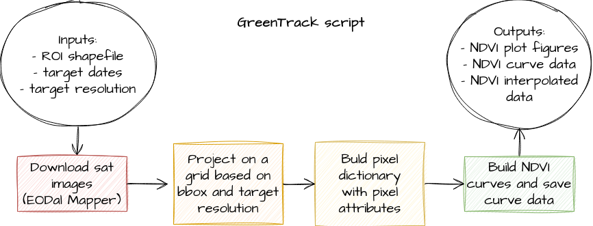

# GreenTrack
Collection of scripts to download Sentinel-2 and SwissAlti3D images for a given shapefile (.shp or .gpkg) and compute annual curves of biomass indicators.
The tools section also contain general-purpose functions for vector and raster data. Sentinel-2 acquisition is based on EOdal (https://github.com/EOA-team/eodal).

### Content
<ul>
  <li> greentrack_tools: collection of related functions (see the function help for more info) </li>
  <li> greentrack_script: download the Sentinel-2 images and generate the growth curves </li>
  <li> greentrack_interactive: after having run greentrack_script, this scrupt allows visualizing clickable growth curves and related images interactively </li>
</ul> 

### Dependences
See the .py files headers

### Credits
2024 Fabio Oriani, Agroscope, fabio.oriani <4t> agroscope.admin.ch   
Related publication: Fabio Oriani, Helge Aasen, Manuel K. Schneider, The growth response of mountain rangelands to annual climatic fluctuations varies along elevation depending on the vegetation type, in submission to Ecological Indicators
